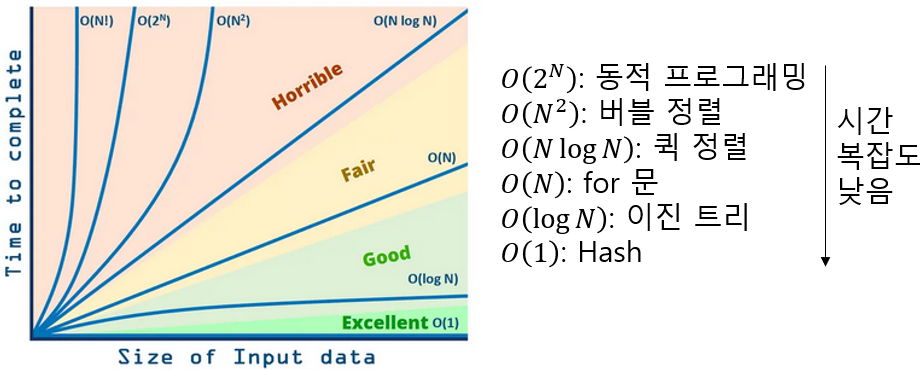

# 2주차 자료 — 자료구조 기본

>주제
>* 배열(Array), 문자열(String)
>* 스택(Stack)
>* 큐(Queue)
>* 덱(Deque)
>* 해시맵(Hash Map = dict/ set)
>* 트리(Tree) 기초
>
> 목표
>* 실무·코딩테스트에서 **가장 자주 쓰는 기본 자료구조**를 개념과 예제로 익힌다.
>* 백준 실습 문제를 통해 **입출력/시간복잡도/경계조건**을 체득한다.

---

## 1. 배열 · 문자열

### 핵심 개념

* **배열**: 같은 종류 데이터를 순서대로 저장. Python에서는 `list`가 동적 배열 역할을 함.
* **문자열**: 문자들의 시퀀스. \*\*불변(immutable)\*\*이라 슬라이스/연결 시 새 문자열이 생김.

### 자주 쓰는 문법

```python
# 입력 빠르게 받기
import sys
input = sys.stdin.readline  # 개행 포함; 필요시 .strip() 사용

# 리스트 생성/순회
n = 5
arr = [0]*n
for i in range(n):
    arr[i] = i*i

# 문자열 다루기
s = "  Hello, World!  "
s = s.strip()          # 앞뒤 공백 제거
parts = s.split(',')   # 구분자 분리
joined = '-'.join(parts)

# 리스트 컴프리헨션
squares = [i*i for i in range(10) if i % 2 == 0]
```

### 시간복잡도 감각

| 자료구조     |   접근/인덱스 |   맨뒤 추가 |   맨뒤 삭제 | 맨앞 추가 | 맨앞 삭제 |
| -------- | -------: | ------: | ------: | ----: | ----: |
| list     |     O(1) | 평균 O(1) |    O(1) |  O(n) |  O(n) |
| deque    |        - |    O(1) |    O(1) |  O(1) |  O(1) |
| dict/set | 키조회 O(1) | 삽입 O(1) | 삭제 O(1) |     - |     - |

* `list` 인덱싱: O(1)
* 끝에 `append`: 평균 O(1)
* 중간 `insert`/`pop(i)`: O(n)
* 문자열 이어붙이기 `a += b`: O(len(a)+len(b)) → 반복문에서는 `''.join()` 권장

---

## 2. 스택(Stack)

### 개념

* **LIFO(Last In First Out)**: 나중에 넣은 게 먼저 나옴.
* 괄호 검사, 되돌리기(undo), DFS 등에 활용.

### Python 구현

```python
stack = []
stack.append(x)  # push
if stack:
    top = stack.pop()  # pop (빈 스택 체크 필수)
```

### 흔한 실수

* 빈 스택에서 `pop()` 하면 에러. 항상 길이 확인.

---

## 3. 큐(Queue)

### 개념

* **FIFO(First In First Out)**: 먼저 온 게 먼저 나감. 대기열/시뮬레이션/BFS.

### Python 구현

* `collections.deque` 사용 (리스트로 pop(0) 금지: O(n))

```python
from collections import deque
q = deque()
q.append(x)      # enqueue
x = q.popleft()  # dequeue (빈 큐 확인 필요)
```

---

## 4. 덱 또는 디큐(Deque)

### 개념

* **Double-Ended Queue**: 양쪽에서 넣고 빼기 빠름.

### Python 구현

```python
from collections import deque
d = deque()
d.append(1)       # 뒤에 넣기
d.appendleft(2)   # 앞에 넣기
d.pop()           # 뒤에서 빼기
d.popleft()       # 앞에서 빼기
```

---

## 5. 해시맵(Hash Map)

### 개념

* 키→값 매핑. 평균 O(1)에 조회/삽입/삭제.
* Python: `dict`, 집합은 `set`.

### 자주 쓰는 패턴

```python
# 빈도 카운트
cnt = {}
for x in data:
    cnt[x] = cnt.get(x, 0) + 1

# 존재 여부 (집합)
seen = set()
if x in seen:
    ...
seen.add(x)

# 양방향 매핑 (예: 번호↔이름)
name_by_id = {1: 'pikachu', 2: 'eevee'}
id_by_name = {v: k for k, v in name_by_id.items()}
```

### 주의

* 해시맵은 **순서 보장 X** (파이썬 3.7+는 입력 순서 유지하지만, 문제마다 요구가 다름).<br> 
정렬 출력 필요하면 `sorted()` 사용.

---

## 6. 트리(Tree) 기초

### 개념

* **사이클 없는 연결 그래프**. 루트에서 자식으로 내려가는 계층 구조.
* 이진트리(자식 ≤ 2), 일반트리(자식 제한 X).

### 표현(두 가지 대표형)

1. **인접 리스트(그래프형)**: 노드 수 많고 간선 입력으로 주어질 때

```python
n = 5
adj = [[] for _ in range(n+1)]
# 예: 간선 u-v 입력 시
adj[u].append(v)
adj[v].append(u)  # 무방향
```

2. **노드 객체** (이진트리 연습용)

```python
class Node:
    def __init__(self, val, left=None, right=None):
        self.val = val
        self.left = left
        self.right = right
```

### 순회

```python
# DFS (재귀)
visited = [False]*(n+1)

def dfs(u):
    visited[u] = True
    for v in adj[u]:
        if not visited[v]:
            dfs(v)

# BFS (큐)
from collections import deque
def bfs(start):
    dist = [-1]*(n+1)
    q = deque([start])
    dist[start] = 0
    while q:
        u = q.popleft()
        for v in adj[u]:
            if dist[v] == -1:
                dist[v] = dist[u] + 1
                q.append(v)
    return dist
```

---

## 7. 입출력 템플릿

```python
import sys
input = sys.stdin.readline

# 한 줄에 정수 여러 개
a, b = map(int, input().split())

# N줄 읽기
n = int(input())
arr = [int(input()) for _ in range(n)]

# 문자열
s = input().strip()   # 개행 제거
```

---

## 8. 시간복잡도
> 알고리즘의 효율성 측정을 위해 필요한 입력 데이터 대비 연산 시 수행 시간을 나타내는 척도


출처: [도리의 디지털라이프](https://blog.skby.net/%EC%8B%9C%EA%B0%84-%EB%B3%B5%EC%9E%A1%EB%8F%84-%EA%B3%B5%EA%B0%84-%EB%B3%B5%EC%9E%A1%EB%8F%84-time-complexity-space-complexity/)

---

## 9. 실습: 백준 문제 가이드 (힌트 중심)

> 문제 번호만 제공됩니다. 제목/입력형식은 백준에서 확인하세요.

### 스택 관련

* **10828 (스택 구현)**

  * 핵심: `push`, `pop`, `size`, `empty`, `top` 명령 처리. 빈 스택 예외 처리 필수.
  * 팁: `sys.stdout.write`로 출력 모으기 → I/O 속도 개선.
* **10773 (제로)**

  * 핵심: 0이 나오면 최근 수 제거 → 스택 `pop`.
  * 팁: 누적합은 마지막에 `sum(stack)`.
* **9012 (괄호)**

  * 핵심: 여는 괄호 push, 닫는 괄호가 오면 pop. 중간에 비면 실패.
  * 팁: 문자열 끝까지 처리 후 스택이 비었는지로 판정.

### 큐/덱 관련

* **10845 (큐), 18258 (큐2)**

  * 핵심: `deque` 사용. `popleft`가 dequeue.
  * 팁: 비어있을 때 `-1` 등 예외 출력 조건 주의.
* **2164 (카드2)**

  * 핵심: `deque`로 맨앞 버리고, 그 다음을 뒤로 보내기 반복.
  * 팁: `popleft` → `append` 순.
* **11866 (요세푸스 0), 1158 (요세푸스)**

  * 핵심: 원을 `deque`로 모델링하고 `rotate` 사용.
  * 예: k번째를 제거하려면 `d.rotate(-(k-1)); ans.append(d.popleft())`.
* **10866 (덱)**

  * 핵심: 덱 명령어 구현. `appendleft`/`popleft`/`append`/`pop` 매핑.
* **1021 (회전하는 큐)**

  * 핵심: 목표 원소를 왼쪽으로 당길지 오른쪽으로 당길지 → **양쪽 거리 비교** 후 `rotate`.
  * 팁: 인덱스 기반으로 `left_dist = idx`, `right_dist = len(d)-idx`.

### 해시/문자열 집합 관련

* **7785 (회사에 있는 사람)**

  * 핵심: 출입 로그를 집합/딕셔너리로 최종 상태만 남기기.
  * 팁: 마지막 출력 정렬(내림차순) 요구 주의.
* **1620 (포켓몬 마스터)**

  * 핵심: 번호→이름, 이름→번호 **이중 매핑**. `dict` 두 개 or 하나로 해결.
  * 팁: 숫자인지 문자열인지 먼저 판별 (`str.isdigit()`).
* **14425 (문자열 집합)**

  * 핵심: `set`에 저장 후 질의마다 membership 테스트.
  * 팁: 입력이 크면 `sys.stdin.readline` + `strip` 필수.

---

## 10. 자주 발생하는 실수 체크리스트

* [ ] 입력 마지막 개행 제거 안 해서 오답 (`strip()` 잊음)
* [ ] 빈 스택/큐에서 pop 시도
* [ ] `list.pop(0)`로 큐 구현(느림) → `deque.popleft()`로 교체
* [ ] 해시맵 출력 시 정렬 요구 조건 미반영
* [ ] 요세푸스/회전 문제에서 회전 방향(양수/음수) 혼동

---

## 11. 연습 루틴(권장)

* Day 1: 배열/문자열, 스택(10828, 10773, 9012)
* Day 2: 큐/덱(10845, 18258, 2164)
* Day 3: 덱 심화(11866, 10866, 1021, 1158)
* Day 4: 해시/문자열(7785, 1620, 14425)
* Day 5: 복습 + 본인 언어로 개념 요약 정리

---

## 12. 추가 예제 코드 모음

### 12-1. 요세푸스(개념 스니펫)

```python
from collections import deque
n, k = 7, 3
q = deque(range(1, n+1))
ans = []
while q:
    q.rotate(-(k-1))
    ans.append(q.popleft())
print(ans)  # 제거 순서
```

### 12-2. 문자열 빈도 세기

```python
s = "mississippi"
count = {}
for ch in s:
    count[ch] = count.get(ch, 0) + 1
print(count)
```

### 12-3. 괄호 유효성 검사(스택)

```python
def is_vps(s):
    stack = []
    for ch in s:
        if ch == '(':
            stack.append(ch)
        else:
            if not stack:
                return False
            stack.pop()
    return not stack
```

---

## 13. 미니 퀴즈 (정답은 토글 클릭)

1. `deque`로 큐를 구현할 때 **꺼내기**에 쓰는 메서드는?
2. 문자열을 반복해서 이어 붙여 큰 문자열을 만들 때 성능 좋은 방법은? (`+` vs `join`)
3. 스택/큐/덱 중, **양쪽**에서 O(1)로 넣고 뺄 수 있는 것은?
4. 해시맵에서 키 존재 여부를 O(1)에 확인하는 파이썬 자료형은?
5. 트리에서 BFS는 어떤 자료구조를 쓰는가?

<details>
<summary>정답 보기</summary>
1. popleft()  <br>
2. ''.join(list_of_strings)  <br>
3. 덱(collections.deque)  <br>
4. set (또는 dict)  <br>
5. 큐(Queue)  <br>
</details>

---

### 부록 A. 메서드 치트시트

```text
list
- append, pop, sort, reverse, index, count
string
- strip, split, join, find, replace
collections.deque
- append, appendleft, pop, popleft, rotate, clear
set
- add, remove, discard, clear, union, intersection
dict
- get, keys, values, items, pop
```

### 부록 B. 출력 성능 팁

```python
# 많은 줄을 출력할 때
import sys
out = []
for x in range(100000):
    out.append(str(x))
sys.stdout.write('\n'.join(out))
```

---

